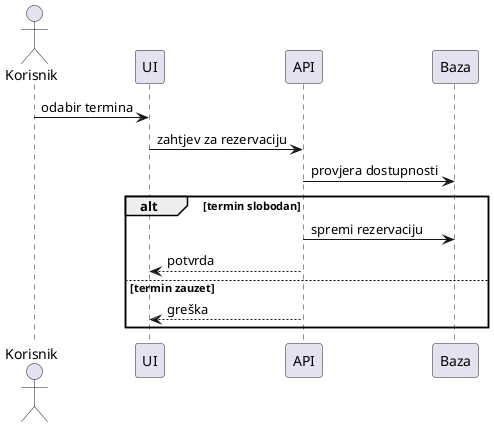
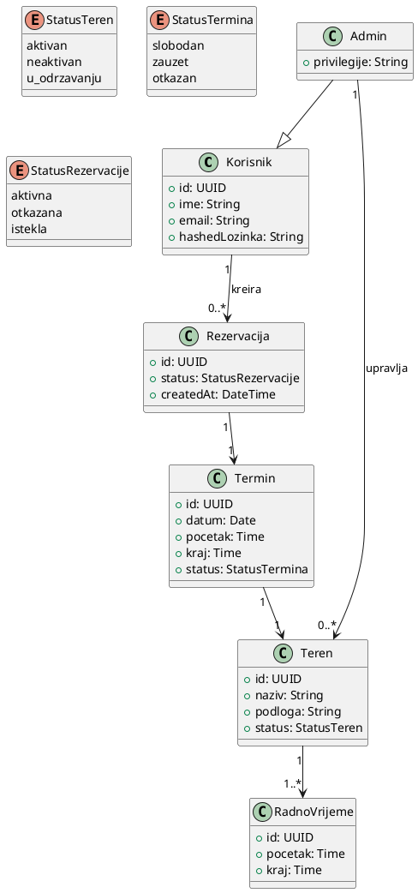

## 2) Sequence dijagram

**Pitanje:** Kako teče proces rezervacije termina korak po korak?

**Objašnjenje (sažeto):**
- Korisnik u sučelju (UI) odabire željeni termin.
- UI šalje zahtjev API-ju za rezervaciju.
- API provjerava u bazi je li termin dostupan.
- Ako je termin slobodan, rezervacija se sprema u bazu i korisnik dobiva potvrdu.
- Ako je termin zauzet, korisniku se prikazuje greška.

**PlantUML kod:**

## 3) Class dijagram

**Pitanje:** Od čega se sustav sastoji i kako su entiteti povezani?

**Objašnjenje (sažeto):**
- Korisnik ima više rezervacija; Admin je specijalizirani korisnik (nasljeđivanje).
- Rezervacija se veže na jedan Termin; Termin pripada jednom Terenu i definiran je vremenom unutar radnog vremena.
- Teren ima definirano radno vrijeme (jedan teren – više pravila radnog vremena).
- Validacija kolizije sprječava dvostruku rezervaciju.

PlantUML Kod:  

